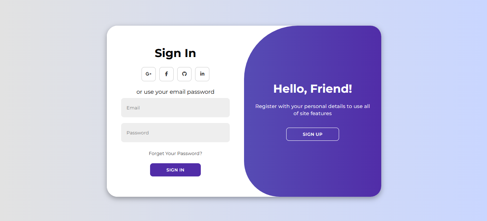
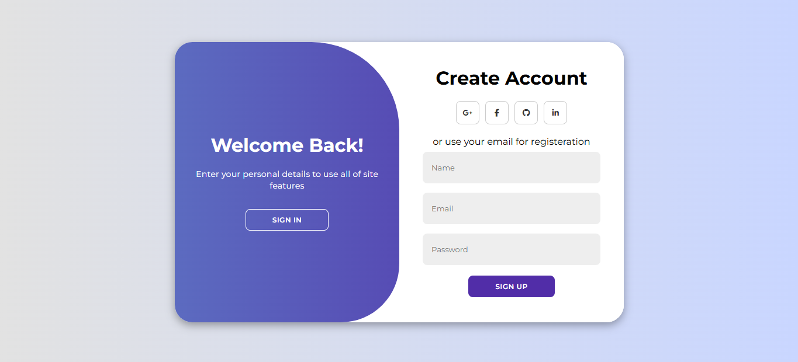

<h1 align="center"> Animated Login Page </h1>

Este projeto é uma interface de login moderna, projetada com um layout limpo e amigável.

    <a href="#-tecnologias">Tecnologias</a>&nbsp;&nbsp;&nbsp;|&nbsp;&nbsp;&nbsp;
    <a href="#-projeto">Projeto</a>&nbsp;&nbsp;&nbsp; |&nbsp;&nbsp;&nbsp;
    <a href="#-licença">Licença</a>&nbsp;&nbsp;&nbsp; |&nbsp;&nbsp;&nbsp;

 

    
    

  ## 🚀 Tecnologias
  Esse projeto foi desenvolvido com as seguintes tecnologias:

  - HTML & CSS
  - JavaScript
  - Git e GitHub

  ## 💻 Projeto
  Esse projeto é uma interface moderna de autenticação com opção de login e registro. Inclui formulário com campos de entrada, botões sociais e design clean. Ideal para ser integrado em aplicações web que precisam de sistema de usuários.

  ## Licença

  Esse projeto está sob a licença MIT.